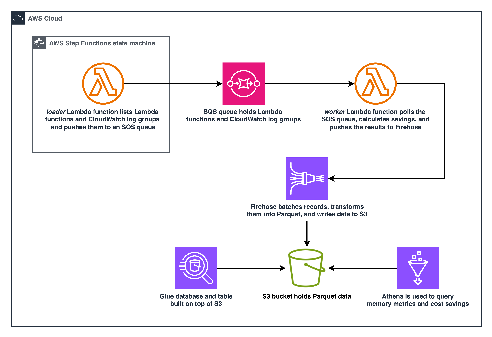

# lambda-memory-utilization

* [Reduce AWS Lambda Cost by Monitoring Memory Utilization]()

## Architecture



## Deploy

Software versions:

```bash
❯ node --version
v20.11.1

❯ cdk --version
2.135.0
```

Install dependencies:

```bash
npm install
```
You need Docker installed and running to package and deploy the Lambda functions.

Deploy stack:

```bash
cdk deploy LambdaMemoryUtilizationStack
```

Invoke step function:

* `regions` defaults all enabled AWS Regions if omitted.
* `days` defaults to 30 if omitted.

```json
{
  "regions": "us-east-1,us-east-2,us-west-1,us-west-2",
  "days": 730
}
```
